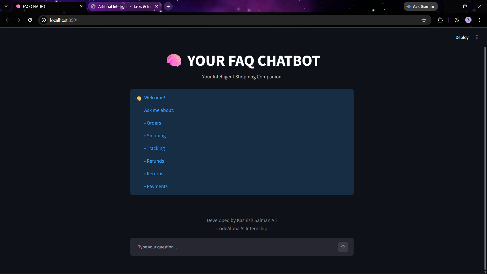
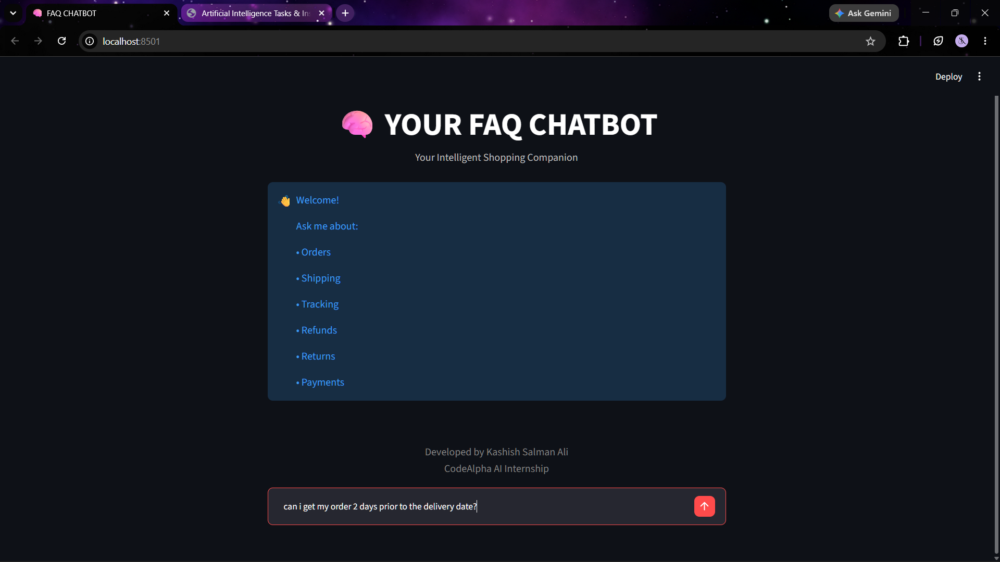
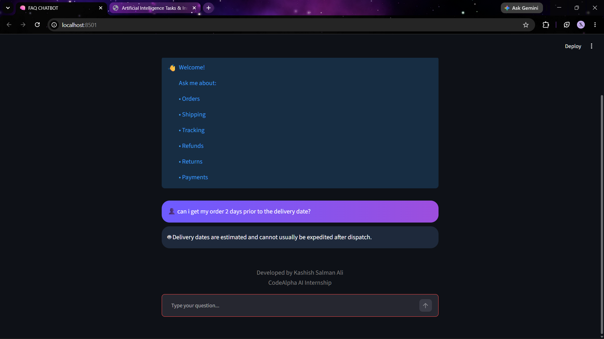
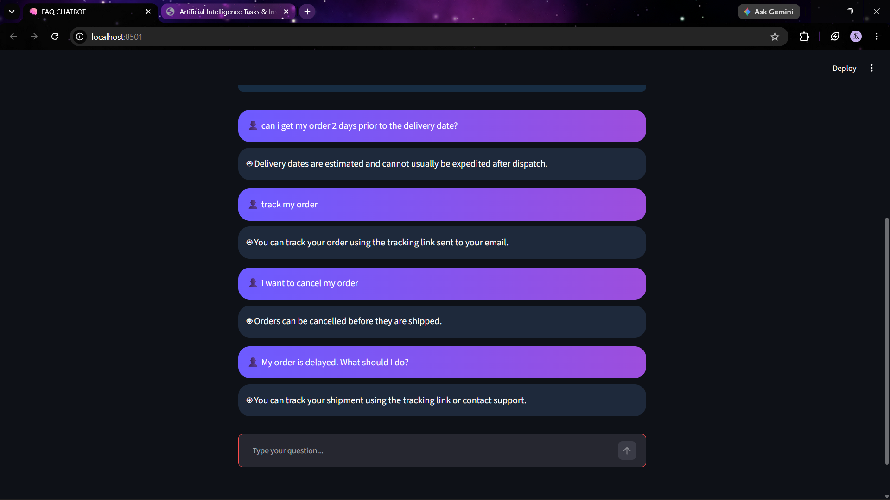

# 🤖 CodeAlpha FAQ Chatbot

An AI-powered FAQ Chatbot developed using Python and Streamlit for the CodeAlpha AI Internship.

## 📌 Features

- Answers frequently asked customer questions
- User-friendly chatbot interface
- Fast response generation
- FAQ knowledge base stored in JSON
- Modern Streamlit UI

## 🛠 Technologies Used

- Python
- Streamlit
- JSON

## 🚀 Installation

Clone the repository:

```bash
git clone https://github.com/kash4sal/CodeAlpha_FAQchatbot.git
```

Install dependencies:

```bash
pip install -r requirements.txt
```

Run the application:

```bash
streamlit run app.py
```

## 📸 Screenshots

### Homepage



### FAQ Interface



### Chatbot Response



### Additional Queries



## 📂 Project Structure

```text
CodeAlpha_FAQchatbot
│
├── app.py
├── faq_data.json
├── requirements.txt
├── README.md
└── screenshots
    ├── homepage.png
    ├── FAQ.png
    ├── answer.png
    └── more_FAQs.png
```

## 👨‍💻 Developer

**Kashish Salman Ali**

CodeAlpha AI Internship
